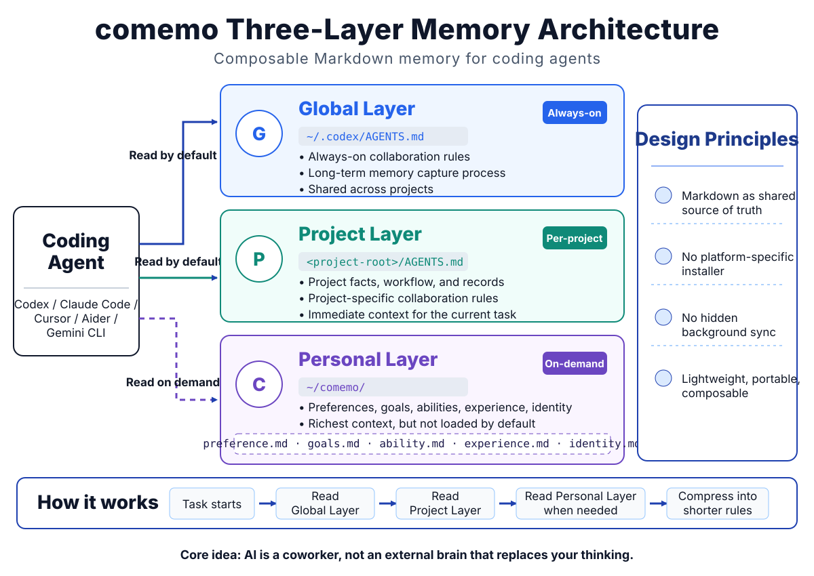

# comemo

**Composable Markdown memory for coding agents.**

comemo is a Markdown memory layout for coding agents. It gives you a simple three-layer memory system that can be read, installed, and adapted by agents without platform-specific installers.

[简体中文](README.zh-CN.md)

<p align="center">
  
</p>

## TL;DR

comemo is a portable Markdown memory layout for coding agents.

It separates memory into three layers:

- Global rules: always-on collaboration rules.
- Project memory: project-specific facts, workflow, and records.
- Personal memory: long-term preferences, goals, abilities, experience, and identity.

It does not install anything automatically. You ask an agent to read the install guide, inspect your current setup, and create or adapt the files safely.

## Why This Exists

Most agent memory setups become messy because global rules, project facts, and long-term personal context are mixed in one place. comemo separates them:

- Project layer: specialized collaboration principles and memory for one project or situation.
- Global layer: always-on collaboration rules and a memory-capture process for long-term improvement.
- comemo layer: detailed personal context that the global layer reads only when needed.

The core memory system is Markdown-only. Adapter files are minimal examples for pointing tools to the shared memory files. There are no shell scripts, PowerShell scripts, Python installers, binaries, or package managers.

## Design Philosophy

comemo is built around one idea: AI is not an external brain that should replace your thinking. It is a coworker.

That is why the memory system is semi-automatic by design. A fully automatic system may look more dramatic: record everything, summarize everything, and let the agent keep accumulating context. comemo takes the opposite path. It asks the human and the AI to think together, decide what is worth preserving, and compress it into rules that are short enough to actually stay useful.

The project layer handles the immediate situation. Different projects need different collaboration rules, different records, and different context. The global layer keeps only the rules that should always be active: hard collaboration rules for getting work done, plus a memory-capture process for getting better over time. The comemo layer stores the richest personal context, but it is read on demand instead of being loaded into every task.

This matters because an agent does not always need to know who you are, how old you are, or every detail of your long-term goals. A good working partner does not need to know your whole life story before helping with a task. They need the right context at the right time.

Memory capture in comemo is not a thick notebook of past mistakes. It should produce compact collaboration principles. Hard, always-on rules belong in the global layer. Softer preferences and personal background belong in the comemo layer. The judgment standard should be built by the human and the AI together.

## Who This Is For

comemo is for people who want a personal memory system for coding agents without giving up their own judgment.

It is especially useful if you:

- worry that long context makes agents slower, more expensive, or less reliable
- want agents to work with you instead of silently replacing your own review
- prefer a small set of durable rules over a large pile of summaries
- use more than one coding agent and want one portable Markdown memory system
- want a lightweight system for personal growth, not just task automation

The author built comemo from this exact anxiety: after only a few conversation turns, context already starts to feel heavy. During development, the author would ask Codex to summarize the current state, then challenge Codex when long context led to weak decisions. comemo is the result of that coworking loop: human judgment plus agent assistance, with memory kept lean on purpose.

## Integration Targets

comemo is designed to work across Windows, macOS, and Linux.

Canonical layout:

```text
~/.codex/AGENTS.md
~/comemo/
<project-root>/AGENTS.md
```

`~/comemo/` is the recommended default memory path. During installation, it is represented as `MEMORY_PATH` and can be changed to any user-approved directory.

Integration type:

| Agent | Integration type | Notes |
| --- | --- | --- |
| Codex | Primary target | Uses `AGENTS.md` directly |
| Claude Code | Bridge | `CLAUDE.md` imports `AGENTS.md` |
| Cursor | Manual / shared instruction | Uses project `AGENTS.md` as shared project context |
| Aider | Adapter example | Adds `AGENTS.md` as read-only context |
| Gemini CLI | Adapter example | Adds `AGENTS.md` to context discovery |

See [Compatibility](docs/compatibility.en.md) for details and limits.

## Quick Start

1. Download or clone this repository.
2. Give the repository to your coding agent.
3. Ask:

```text
Read docs/agent-install.en.md and help me install comemo.
```

For Chinese:

```text
阅读 docs/agent-install.zh-CN.md，并帮我安装 comemo。
```

The agent should inspect your existing memory files, show the install plan, avoid silent overwrites, and verify the result.

If you already use another memory system, comemo should adapt instead of replace it. Existing native files such as `CLAUDE.md`, `GEMINI.md`, `.cursor/rules`, `.cursorrules`, `.aider.conf.yml`, and `AGENTS.override.md` should be left untouched unless you explicitly approve changes.

## Examples and Notes

- [Basic install example](examples/basic-install/README.md)
- [FAQ](docs/faq.en.md)
- [AI-assisted development](docs/ai-assisted-development.md)

## Languages

comemo includes two template sets:

```text
templates/en/
templates/zh-CN/
```

Language controls both content and long-term memory filenames.

English memory files:

```text
MEMORY_PATH/preference.md
MEMORY_PATH/goals.md
MEMORY_PATH/ability.md
MEMORY_PATH/experience.md
MEMORY_PATH/identity.md
```

Chinese memory files:

```text
MEMORY_PATH/偏好.md
MEMORY_PATH/目标.md
MEMORY_PATH/能力.md
MEMORY_PATH/经验.md
MEMORY_PATH/身份.md
```

The `AGENTS.md` filename is fixed for Codex-style instruction files. Do not rename it to `AGENT.md`.

## Repository Layout

```text
comemo/
|-- README.md
|-- README.zh-CN.md
|-- LICENSE
|-- CHANGELOG.md
|-- CONTRIBUTING.md
|-- SECURITY.md
|-- .github/
|   |-- pull_request_template.md
|   `-- ISSUE_TEMPLATE/
|-- docs/
|   |-- agent-install.en.md
|   |-- agent-install.zh-CN.md
|   |-- compatibility.en.md
|   |-- compatibility.zh-CN.md
|   |-- faq.en.md
|   |-- faq.zh-CN.md
|   |-- install-checklist.en.md
|   |-- install-checklist.zh-CN.md
|   |-- ai-assisted-development.md
|   `-- release-checklist.md
|-- templates/
|   |-- en/
|   `-- zh-CN/
|-- adapters/
|   |-- codex/
|   |-- claude/
|   |-- cursor/
|   |-- aider/
|   `-- gemini/
`-- examples/
    `-- basic-install/
```

## Non-Goals

comemo does not include:

- platform-specific installers
- automatic migration scripts
- hidden background sync
- tool-specific duplicate memory systems

Adapters are intentionally thin. The shared source of truth remains Markdown.

## License

MIT License. See [LICENSE](LICENSE).
