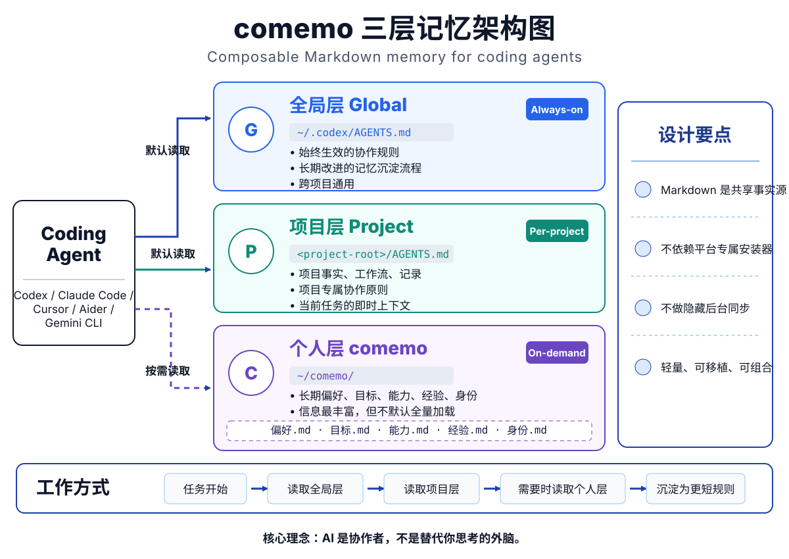

# comemo

**面向 coding agent 的可组合 Markdown 记忆结构。**

comemo 是一套给 coding agent 用的 Markdown 记忆结构，用来建立可读、可迁移、可维护的协作记忆。

[English](README.md)

<p align="center">
  
</p>

## 简要说明

comemo 是一套给 coding agent 用的可迁移 Markdown 记忆结构。

它把记忆拆成三层：

- 全局规则：所有协作都生效的硬规则。
- 项目记忆：当前项目的事实、流程和记录位置。
- 个人长期记忆：偏好、目标、能力、经验、身份。

它不是自动安装器。你把仓库交给 Agent，让它阅读安装文档，先检查现有记忆系统，再安全创建或适配文件。

## 为什么做这个

很多 Agent 记忆系统最后会乱，是因为全局规则、项目事实、长期偏好混在一起。comemo 把它们拆成三层：

- 项目层：面向特定项目和情境的个性化协作原则与记忆。
- 全局层：常驻的协作硬规则，以及让人和 AI 一起成长的记忆沉淀流程。
- comemo 层：最详细的个人长期信息，由全局层按需读取，而不是每次都塞进上下文。

核心记忆系统只依赖 Markdown。adapter 目录只提供最小桥接示例，用来让不同工具指向同一套共享记忆文件。不提供 `.sh`、`.ps1`、`.py`、二进制安装器或包管理器安装流程。

## 设计理念

comemo 背后的想法很简单：AI 不是外接大脑，而是合作伙伴。

所以它不是一个追求全自动的系统。全自动当然更有戏剧性：什么都记录，什么都总结，最后堆出一个越来越厚的记忆库。但我更想要的是半自动。人和 AI 一起工作，一起判断什么值得留下，再把经验压缩成足够短、足够硬、以后真的能用上的协作原则。

项目层负责当下情境。不同项目需要不同的协作方式、记录方式和事实边界。全局层只放所有任务都应该常驻的内容：用来工作的协作硬规则，以及用来成长的记忆沉淀流程。comemo 层放最详细的个人信息，但它应该按需被读取，而不是默认全部加载。

这点很重要。Agent 并不总需要知道你是谁、今年几岁、长期目标是什么。就像你找一个搭档一起干活，不等于要找一个了解你全部人生的伴侣。多数时候，它只需要在正确的时机拿到正确的背景。

记忆沉淀也不应该变成一本越来越厚的错题本。它应该是人和 AI 一起思考以后，提炼出一条凝练到极致的协作原则。硬性的常驻规则写进全局层；偏好、身份、目标、能力这些软信息写进底层 comemo。判断标准不是 AI 单方面替你总结，而是人和 AI 一起构建。

## 适合谁

comemo 适合想给 coding agent 建立个人记忆系统，同时又不想放弃自己判断的人。

它尤其适合这些情况：

- 你担心上下文过长会让 AI 变慢、变贵、变不可靠。
- 你希望 AI 和你一起工作，而不是默默替你做完所有总结。
- 你更相信少量长期有效的规则，而不是越堆越厚的摘要。
- 你同时使用多个 coding agent，希望记忆系统可以跨工具迁移。
- 你想做的是促进自我成长的半自动系统，而不只是任务自动化。

这个项目也有一个小彩蛋：comemo 是我和 Codex 互帮互助做出来的。开发过程中，我经常因为上下文太长而焦虑，对话没几轮就想问「帮我整理下当下情况」。Codex 能帮我总结，但上下文变长以后也会决策变弱，这时又需要我提出质疑。comemo 就是在这种共同工作的过程中长出来的：让 AI 帮忙，但人仍然保留判断；让记忆沉淀，但刻意保持精简。

## 集成目标

comemo 设计上适配 Windows、macOS、Linux。

推荐基础结构：

```text
~/.codex/AGENTS.md
~/comemo/
<project-root>/AGENTS.md
```

`~/comemo/` 是推荐默认长期记忆路径。安装时它对应 `MEMORY_PATH`，可以改成用户明确选择的任意目录。

集成方式：

| Agent | 集成方式 | 说明 |
| --- | --- | --- |
| Codex | 主要目标 | 直接使用 `AGENTS.md` |
| Claude Code | 桥接 | 用 `CLAUDE.md` 导入 `AGENTS.md` |
| Cursor | 手动 / 共享项目规则 | 使用项目级 `AGENTS.md` 作为共享上下文 |
| Aider | adapter 示例 | 把 `AGENTS.md` 加为只读上下文 |
| Gemini CLI | adapter 示例 | 把 `AGENTS.md` 加入上下文发现范围 |

具体边界见 [兼容性说明](docs/compatibility.zh-CN.md)。

## 快速开始

1. 下载或克隆本仓库。
2. 把仓库交给你的 coding agent。
3. 对它说：

```text
阅读 docs/agent-install.zh-CN.md，并帮我安装 comemo。
```

英文用户可以说：

```text
Read docs/agent-install.en.md and help me install comemo.
```

Agent 应该先检查你的现有记忆文件，展示安装计划，不静默覆盖已有文件，并在安装后验证结果。

如果你已经在用其他记忆系统，comemo 应该适配，而不是替换。已有原生文件，例如 `CLAUDE.md`、`GEMINI.md`、`.cursor/rules`、`.cursorrules`、`.aider.conf.yml` 和 `AGENTS.override.md`，默认应保持不动，除非你明确批准修改。

## 示例和说明

- [基础安装示例](examples/basic-install/README.zh-CN.md)
- [常见问题](docs/faq.zh-CN.md)
- [AI 辅助开发说明](docs/ai-assisted-development.md)

## 语言版本

comemo 内置两套模板：

```text
templates/en/
templates/zh-CN/
```

语言会同时影响模板正文和长期记忆文件名。

英文长期记忆文件：

```text
MEMORY_PATH/preference.md
MEMORY_PATH/goals.md
MEMORY_PATH/ability.md
MEMORY_PATH/experience.md
MEMORY_PATH/identity.md
```

中文长期记忆文件：

```text
MEMORY_PATH/偏好.md
MEMORY_PATH/目标.md
MEMORY_PATH/能力.md
MEMORY_PATH/经验.md
MEMORY_PATH/身份.md
```

`AGENTS.md` 是 Codex 风格指令文件的固定文件名。不要改成 `AGENT.md`。

## 仓库结构

```text
comemo/
|-- README.md
|-- README.zh-CN.md
|-- LICENSE
|-- CHANGELOG.md
|-- CONTRIBUTING.md
|-- SECURITY.md
|-- .github/
|   |-- pull_request_template.md
|   `-- ISSUE_TEMPLATE/
|-- docs/
|   |-- agent-install.en.md
|   |-- agent-install.zh-CN.md
|   |-- compatibility.en.md
|   |-- compatibility.zh-CN.md
|   |-- faq.en.md
|   |-- faq.zh-CN.md
|   |-- install-checklist.en.md
|   |-- install-checklist.zh-CN.md
|   |-- ai-assisted-development.md
|   `-- release-checklist.md
|-- templates/
|   |-- en/
|   `-- zh-CN/
|-- adapters/
|   |-- codex/
|   |-- claude/
|   |-- cursor/
|   |-- aider/
|   `-- gemini/
`-- examples/
    `-- basic-install/
```

## 不做什么

comemo 不提供：

- 平台专用安装器
- 自动迁移脚本
- 后台同步
- 每个工具各维护一套重复记忆

适配器只做轻量桥接。共享事实源仍然是 Markdown。

## 协议

MIT License。见 [LICENSE](LICENSE)。
